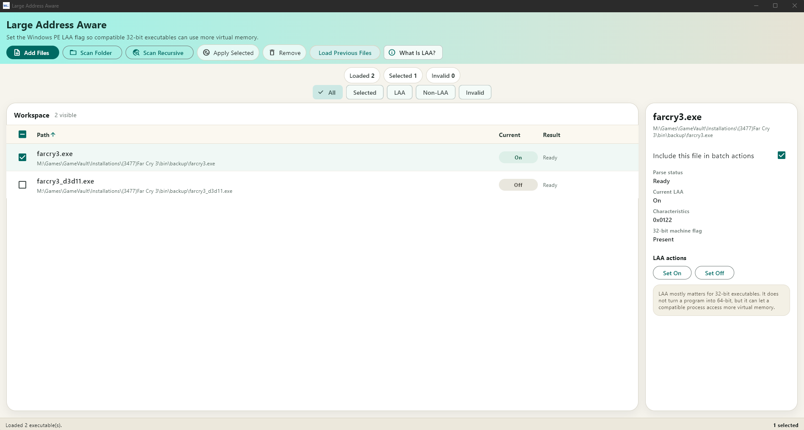

# Large Address Aware

Large Address Aware is a Flutter Windows desktop utility for inspecting Windows `.exe` files and turning the PE `IMAGE_FILE_LARGE_ADDRESS_AWARE` flag on or off.

## Screenshot



## Features

- Add `.exe` files from a file picker, drag and drop, or folder scan.
- Inspect PE header state without external native helpers.
- Apply LAA changes to a single file or a checked batch.
- Restore the last saved workspace when `Load Previous Files` is enabled.

## Requirements

- Flutter SDK with Windows desktop support enabled.
- Windows build tooling for local release builds.
- Administrator rights when running the shipped Windows app, because the native runner manifest requests elevation.

## Local Development

Install dependencies:

```powershell
flutter pub get
```

Run the app on Windows:

```powershell
flutter run -d windows
```

Run validation:

```powershell
flutter test
flutter analyze
```

Build a local Windows release:

```powershell
flutter build windows --release
```

The release output is written to `build/windows/x64/runner/Release/`.
